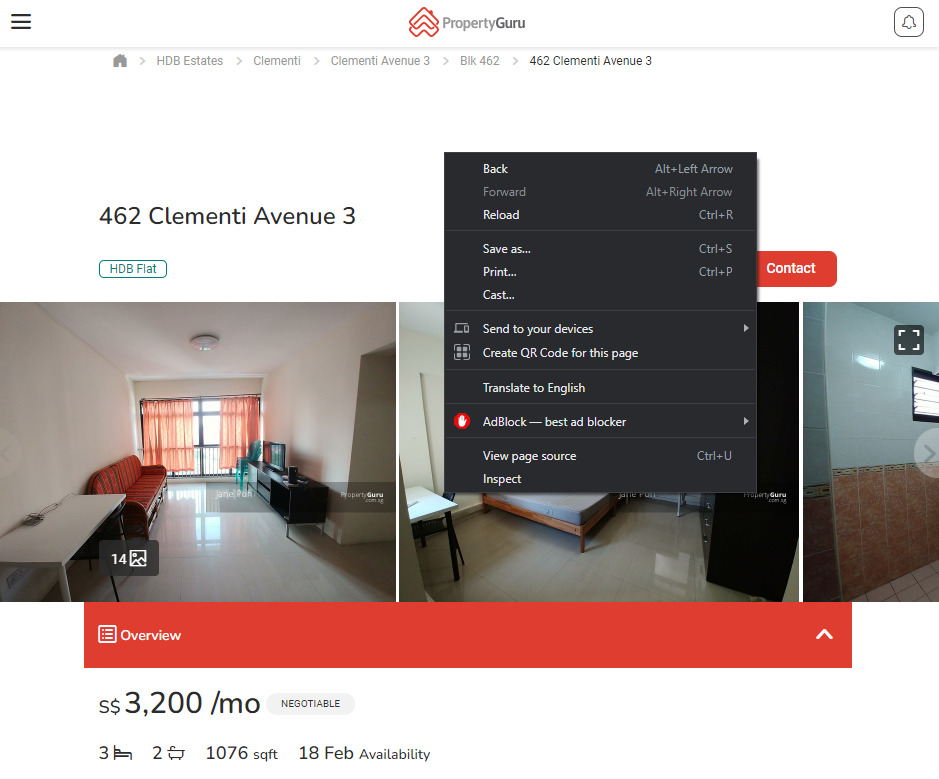

# Property-Guru-Scraper

1. For each property listing (for eg [462 Clementi Avenue 3](https://www.propertyguru.com.sg/listing/hdb-for-rent-462-clementi-avenue-3-20015339)), right-click and save the html (Ctrl+S) to a folder called `input`.

2. `python rental_property_scrapper.py`
3. Output will be in a csv file called `output.csv`